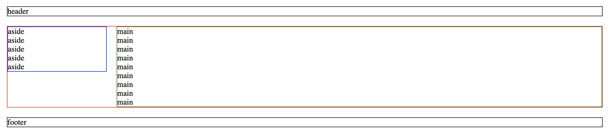
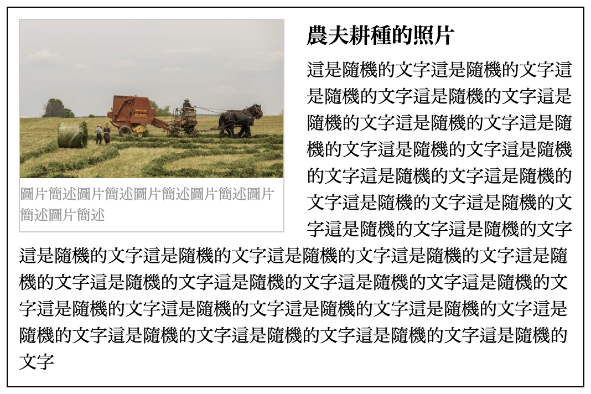

# 7. 練習

## 1 二欄固定式版型

指定檔名： `two_columns.html` 

* 整體寬度 1200px 置中。
* 間距都設定 20px。
* 側邊欄 200px。

完成結果：






## 2 直向圖文編排

指定檔名：`text_vertical.html`

說明：

* 圖片路徑：[https://picsum.photos/id/729/500/300](https://picsum.photos/id/729/500/300)
* 圖片點擊開新分頁連至外站\(任意網址皆可\)。
* 最外層用 article 標籤製作。寬度 300px。
* 標題「農夫耕種的照片」用 h1 標籤製作。
* 標題文字大小 1.2rem。

結果示意圖：


提供 html：

```markup
<article class="card">
  
  <a href="https://tw.yahoo.com/" target="_blank" class="img_block"></a>
  
  <div class="content_block">
    <h1>農夫耕種的照片</h1>

    <p>這是隨機的文字這是隨機的文字這是隨機的文字這是隨機的文字這是隨機的文字這是隨機的文字這是隨機的文字這是隨機的文字這是隨機的文字這是隨機的文字這是隨機的文字這是隨機的文字這是隨機的文字
    </p>
  </div>
</article>
```




## 3 介面 - 橫向圖文編排\(文繞圖\)

指定檔名：`text_horizontal.html`

說明：

* 圖片路徑：[https://picsum.photos/id/729/500/300](https://picsum.photos/id/729/500/300)
* 圖片點擊開新分頁連至外站\(任意網址皆可\)。
* 最外層用 article 標籤製作。寬度 500px。
* 標題「農夫耕種的照片」用 h1 標籤製作。
* 標題文字大小 1.2rem。
* 提示1：比照「直向圖文編排」，在結構上只加了一個「圖片簡述的文字」，其餘結構完全不會變，只調整樣式。
* 提示2：連結區塊\(灰框部份\)設定成向左的浮動\(float\)。

結果示意圖：



提供 html：

```markup
<article class="card">
  
  <a href="https://tw.yahoo.com/" target="_blank" class="img_block">
    
    <span class="img_text">圖片簡述圖片簡述圖片簡述圖片簡述圖片簡述圖片簡述</span>
  </a>
  
  <div class="content_block">
    <h1>農夫耕種的照片</h1>

    <p>這是隨機的文字這是隨機的文字這是隨機的文字這是隨機的文字這是隨機的文字這是隨機的文字這是隨機的文字這是隨機的文字這是隨機的文字這是隨機的文字這是隨機的文字這是隨機的文字這是隨機的文字這是隨機的文字這是隨機的文字這是隨機的文字這是隨機的文字這是隨機的文字這是隨機的文字這是隨機的文字這是隨機的文字這是隨機的文字這是隨機的文字這是隨機的文字這是隨機的文字這是隨機的文字這是隨機的文字這是隨機的文字這是隨機的文字這是隨機的文字這是隨機的文字這是隨機的文字這是隨機的文字</p>
  </div>
</article>
```




## 4 介面 - Pagination 分頁

指定檔名：`pagination.html`

說明：

* 列表使用 ul 標籤。
* 框線顏色：`#dee2e6`。
* 文字顏色：`#dee2e6`。
* 滑鼠移過：背景色變成 `#e9ecef`；文字顏色變成 `#0056b3`。
* 假設在第1頁：那 1 的樣式，預設要與滑鼠移過時的狀態一樣。

結果示意：



提供 html：

```markup
<div class="pagination_block">
  <ul class="pagination">
    <li><a href="#">&lt;</a></li>
    <li><a href="#" class="-on">1</a></li>
    <li><a href="#">2</a></li>
    <li><a href="#">3</a></li>
    <li><a href="#">4</a></li>
    <li><a href="#">5</a></li>
    <li><a href="#">6</a></li>
    <li><a href="#">7</a></li>
    <li><a href="#">8</a></li>
    <li><a href="#">9</a></li>
    <li><a href="#">10</a></li>
    <li><a href="#">&gt;</a></li>
  </ul>
</div>
```




## 5 頁面滑動時，上方置頂區域的隱藏與顯示

指定檔名：`fix_bar.html`

說明：

* 一個置頂的區域，在最上方想辦法隱藏。
* 使用者頁面往下滑動大於等於 100px 時，置頂區域要滑出顯示。
* 使用者頁面往上滑動到小於 100px 時，置頂區域隱藏。

結果示意：



提供 html：

```markup
<div class="fixed_top">這是置頂的區域</div>
```

提供 jQuery 的版本：

```javascript
var header_active = function(){
  
  // 取得使用者滑了多少 px
  var scroll_top = $(window).scrollTop();
  
  // 將 scroll_top 數值放到 p.-pos 內容
  $("p.-pos").html(scroll_top);
  
  
  if(scroll_top >= 100){
    $("div.fixed_top").addClass("-on");
  }else{
    $("div.fixed_top").removeClass("-on");
  }
  
};


$(function(){
  
  // 第三步：偵測頁面滑動時會觸發
  $(window).scroll(function(){
    header_active();
  });
  
});
```




