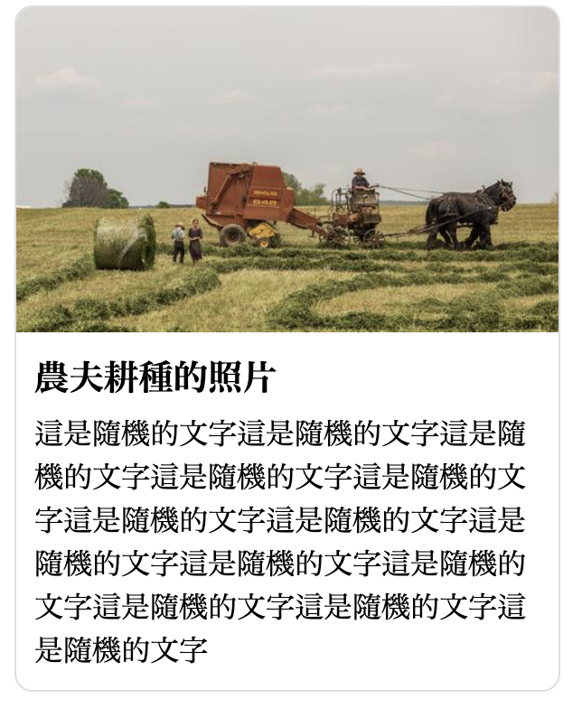

# 8. 練習

## 1 二欄固定式版型

指定檔名： `two_columns.html` 

* 整體寬度 1200px 置中。
* 間距都設定 20px。
* 側邊欄 200px。

完成結果：

## 2 直向圖文編排

指定檔名：`text_vertical.html`

說明：

* 圖片路徑：[https://picsum.photos/id/729/500/300](https://picsum.photos/id/729/500/300)
* 圖片點擊開新分頁連至外站\(任意網址皆可\)。
* 最外層用 article 標籤製作。寬度 300px。
* 標題「農夫耕種的照片」用 h1 標籤製作。
* 標題文字大小 1.2rem。

結果示意圖：

## 3 介面 - 橫向圖文編排\(文繞圖\)

指定檔名：`text_horizontal.html`

說明：

* 圖片路徑：[https://picsum.photos/id/729/500/300](https://picsum.photos/id/729/500/300)
* 圖片點擊開新分頁連至外站\(任意網址皆可\)。
* 最外層用 article 標籤製作。寬度 500px。
* 標題「農夫耕種的照片」用 h1 標籤製作。
* 標題文字大小 1.2rem。
* 提示1：比照「直向圖文編排」，在結構上只加了一個「圖片簡述的文字」，其餘結構完全不會變，只調整樣式。
* 提示2：連結區塊\(灰框部份\)設定成向左的浮動\(float\)。

結果示意圖：

