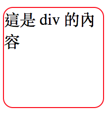
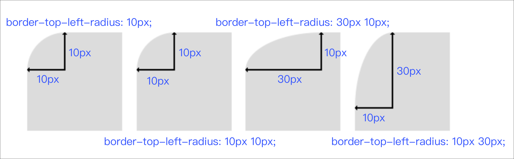
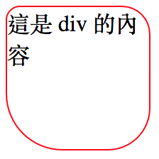
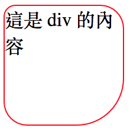
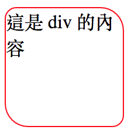

# 3.14 圓角

## 範例：基本語法

HTML

```markup
<div class="test_radius">這是 div 的內容</div>
```

CSS

```css
div.test_radius{
  width: 100px;
  height: 100px;
  border:1px solid red;

  border-radius: 10px; /* 左上、右上、右下、左下，四個角，都會變成 10px 的圓角 */
}
```

如圖：



## 繪製原理

以「左上角」為例：



若要單一指定某一個角的話，分別是

* border-top-left
* border-top-right
* border-bottom-right
* border-bottom-left

## 各種寫法範例

圓角順序：左上\(10px\)、右上\(20px\)、右下\(30px\)、左下\(40px\)：

```css
border-radius: 10px 20px 30px 40px;
```



圓角順序：左上\(10px\)、右上及左下\(20px\)、右下\(40px\)：

```css
border-radius: 10px 20px 40px;
```



圓角順序：左上及右下\(10px\)、右上及左下\(20px\)：

```css
border-radius: 10px 20px;
```



