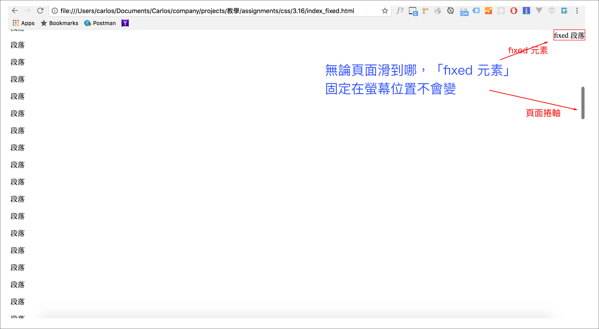
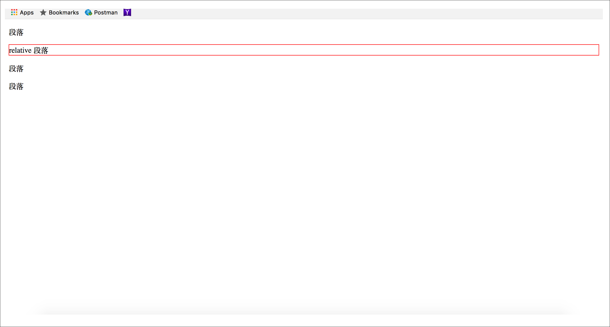
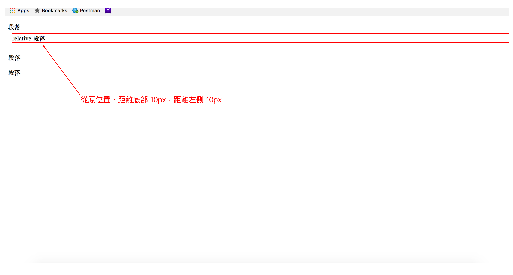
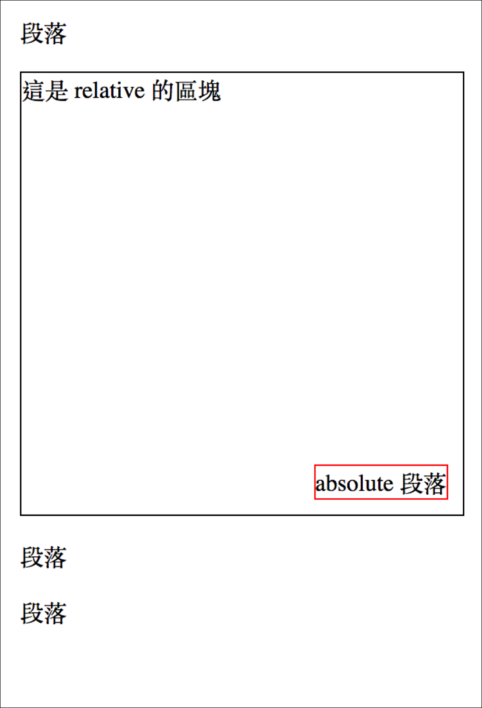

# 3.17 排版 - 關於定位\(position\)

一個元素，在版面中的位置，就叫做定位，有幾種基本的定位型態，可設定的值有：

* **static**：這是所有元素的預設值。
* **fixed**：固定定位，相對於螢幕。
* **relative**：相對定位。相對於自己原來的位置。
* **absolute**：絕對定位。找到上層第一個相對定位、絕對定位、固定定位的元素，相對於它來定位。

## 定位模式：fixed

不論使用者滑動到頁面的哪個區域， fixed 元素都會固定在螢幕的指定位置，都不會變。例：

HTML：

```markup
<p>段落</p>
<p class="the_fixed">fixed 段落</p>
<p>段落</p>
<p>段落</p>
<p>段落</p>
<p>段落</p>
<p>段落</p>
<p>段落</p>
<p>段落</p>
<p>段落</p>
<p>段落</p>
<p>段落</p>
<p>段落</p>
<p>段落</p>
<p>段落</p>
<p>段落</p>
<p>段落</p>
<p>段落</p>
<p>段落</p>
<p>段落</p>
<p>段落</p>
<p>段落</p>
<p>段落</p>
<p>段落</p>
<p>段落</p>
<p>段落</p>
<p>段落</p>
<p>段落</p>
<p>段落</p>
<p>段落</p>
<p>段落</p>
<p>段落</p>
<p>段落</p>
<p>段落</p>
<p>段落</p>
<p>段落</p>
<p>段落</p>
<p>段落</p>
<p>段落</p>
<p>段落</p>
<p>段落</p>
<p>段落</p>
<p>段落</p>
<p>段落</p>
<p>段落</p>
<p>段落</p>
<p>段落</p>
<p>段落</p>
<p>段落</p>
<p>段落</p>
<p>段落</p>
<p>段落</p>
<p>段落</p>
<p>段落</p>
<p>段落</p>
<p>段落</p>
<p>段落</p>
<p>段落</p>
<p>段落</p>
<p>段落</p>
<p>段落</p>
<p>段落</p>
<p>段落</p>
<p>段落</p>
<p>段落</p>
<p>段落</p>
<p>段落</p>
<p>段落</p>
<p>段落</p>
<p>段落</p>
<p>段落</p>
<p>段落</p>
<p>段落</p>
<p>段落</p>
<p>段落</p>
<p>段落</p>
<p>段落</p>
<p>段落</p>
<p>段落</p>
<p>段落</p>
<p>段落</p>
<p>段落</p>
<p>段落</p>
<p>段落</p>
<p>段落</p>
<p>段落</p>
<p>段落</p>
<p>段落</p>
<p>段落</p>
<p>段落</p>
<p>段落</p>
<p>段落</p>
<p>段落</p>
<p>段落</p>
<p>段落</p>
<p>段落</p>
<p>段落</p>
<p>段落</p>
<p>段落</p>
<p>段落</p>
<p>段落</p>
<p>段落</p>
<p>段落</p>
<p>段落</p>
<p>段落</p>
<p>段落</p>
<p>段落</p>
<p>段落</p>
<p>段落</p>
<p>段落</p>
<p>段落</p>
<p>段落</p>
<p>段落</p>
<p>段落</p>
<p>段落</p>
<p>段落</p>
<p>段落</p>
<p>段落</p>
<p>段落</p>
<p>段落</p>
<p>段落</p>
<p>段落</p>
<p>段落</p>
<p>段落</p>
<p>段落</p>
<p>段落</p>
<p>段落</p>
<p>段落</p>
<p>段落</p>
<p>段落</p>
<p>段落</p>
<p>段落</p>
<p>段落</p>
<p>段落</p>
<p>段落</p>
<p>段落</p>
<p>段落</p>
<p>段落</p>
<p>段落</p>
<p>段落</p>
<p>段落</p>
<p>段落</p>
<p>段落</p>
<p>段落</p>
```

CSS：

```css
p.the_fixed{
  border:1px solid red;
  margin:0;
  padding:0;

  /* 改變定位模式(fixed) */
  position: fixed;
  right:0;
  top:0;
}
```

結果：



## 定位模式：relative

相對於自己原來的位置，該如何移動。例：

HTML：

```markup
<p>段落</p>
<p class="the_relative">relative 段落</p>
<p>段落</p>
<p>段落</p>
```

CSS：

```css
p.the_relative{
  border:1px solid red;

  position: relative;
  /*
  bottom: 10px;
  left:10px;
  */
}
```

結果：\(先看看原位置\)



將 CSS 改成：

```css
p.the_relative{
  border:1px solid red;

  position: relative;
  bottom: 10px;
  left:10px;
}
```

結果：



## 定位模式：absolute

找到上層第一個相對定位、絕對定位、固定定位的元素，相對於它來定位。例：

HTML：

```markup
<p>段落</p>
<div class="relative_block">
  這是 relative 的區塊
  <p class="the_absolute">absolute 段落</p>
</div>
<p>段落</p>
<p>段落</p>
```

CSS：

```css
div.relative_block{
  position: relative;
  border:1px solid black;
  width: 300px;
  height: 300px;
}
p.the_absolute{
  border:1px solid red;
  margin:0;

  position: absolute;
  bottom: 10px;
  right:10px;
}
```

結果：



## z-index

元素當中如果在同一層，定位上有相互交疊的狀態，可以使用 z-index ，設定整數來決定哪個元素的疊層順序。愈大的值，代表會出現在愈上方。

## 練習範例

圖片連結：[https://picsum.photos/id/211/800/400](https://picsum.photos/id/211/800/400)

提供 html 結構：

```markup
<div class="pic_item">
  <a href="#" class="pic_link" target="_blank">
    
  </a>
  <span class="-hot">熱門</span>
  <div class="item_desc">這是圖片描述</div>
</div>
```




