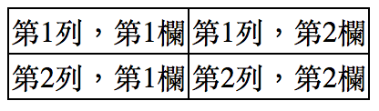
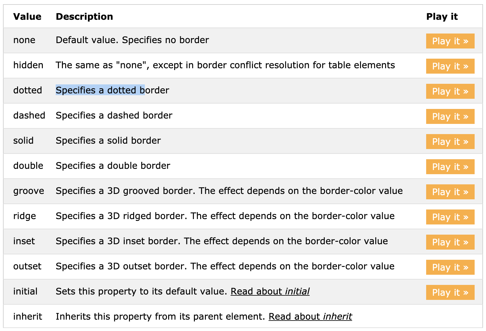

# 3.10 表格樣式

HTML 基本結構

```markup
<table>
  <tr>
    <td>第1列，第1欄</td>
    <td>第1列，第2欄</td>
  </tr>
  <tr>
    <td>第2列，第1欄</td>
    <td>第2列，第2欄</td>
  </tr>
</table>
```

結果\(會發現預設的狀態是毫無邊框的\)：


## 呈現邊框\(border\)

CSS：

```css
table{
  border:1px solid black;
}
table td{
  border:1px solid black;
}
```

結果：會發現各欄位的邊框都會有些間距：


## border-collapse

可選的值有：

* `seperate`：這是預設值。
* `collapse`：可讓各欄位直接緊鄰合併，而邊框還是會存在。

例如 CSS 改成下方：

```css
table{
  border:1px solid black;
  border-collapse: collapse;
}
table td{
  border:1px solid black;
}
```

結果呈現



## 介紹 border

```css
border: 1px solid black;
```

等同於：

```css
border-top: 1px solid black;
border-right: 1px solid black;
border-bottom: 1px solid black;
border-left: 1px solid black;
```

等同於：

```css
border-width: 1px;
border-style: solid;
border-color: black;
```

等同於\(以 `border-top` 為例\)：

```css
border-top-width: 1px;
border-top-style: solid;
border-top-color: black;
```

註：[有哪些 border style](https://www.w3schools.com/cssref/pr_border-style.asp)



