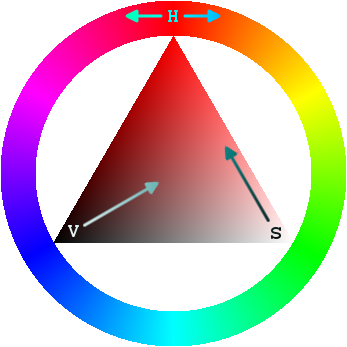

# 3.7 文字樣式

更改文字的樣式，常用包含：

* `font-size`：文字大小。例：**20px**。文字大小的單位其它還有 **em**、**rem**、**%**，這三個都是相對單位。
* `font-weight`：文字粗體，值有 **100**、**200**、**300**、**400**\(**normal**\)、**500**、**600**、**700**\(**bold**\)、**800**、**900**。
* `font-style`：可選的值有：**normal**\(這是預設值\)、**italic**\(會顯示成斜體\)。
* `color`：改變文字顏色。值的格式範例：**red**、**\#999999**。其它格式還有 **RGB**、**RGBA**、**HSL**、**HSLA**。
* `text-decoration`：畫線。可選的有 **underline**\(畫底線\)、**overline**\(底線畫在上方\)、**line-through**\(畫刪除線\)、**none**\(不畫線\)。
* `text-transform`：**capitalize**\(英文每個詞的首字母都會變大寫\)、**uppercase**\(每個英文字母都變大寫\)、**lowercase**\(每個英文字母都變小寫\)、**none**\(不轉換\)。
* `text-align`：文字對齊，可選的值有 **left**、**right**、**center**。
* `line-height`：行高。通常以**倍數**來表示，例：此值是 **2** 的話，而文字大小是16px，則行高就是 32px。當然也可以指定固定的 **24px** 這種固定行高。
* `font-family`：指定字體。例：`font-family: "Times New Roman", arial, helvetica, serif;`。會以最左邊開始尋找，若 "Times New Roman" 在電腦裡有此字體的話，就會以此字體來顯示，然而若沒有的話，就會再尋找下一個 arial。

## 文字大小單位

* px：固定單位
* em：相對單位，相較於父元素
* rem：相對單位，相較於 `<html>` 根元素

html

```markup
<!doctype html>
<html>
  <head></head>
  <body>
    <div class="text1">
      文字1
      <div class="text2">文字2</div>
    </div>
  </body>
</html>
```

css

```css
html{
  font-size: 10px;
  /*
  或
  font-size: 62.5%;
  */
}
div.text1{
  font-size: 2rem; /* 結果：20px */
}
div.text2{
  font-size: 2em;  /* 結果：40px */
}
```

## 顏色指定格式\(介紹 HSLA\)

**Hue-Saturation-Lightness-Alpha**

```css
p{
  color: hsla(0~360, 0 ~ 100%, 0 ~ 100%, 0 ~ 1);
  background-color:hsla(0~360, 0 ~ 100%, 0 ~ 100%, 0 ~ 1);
}
```

* h：色相：0 ~ 360
* s：飽和度：0% ~ 100%，0%就變灰色
* l：亮度：0% ~ 100%，0% 就會變黑色，100% 就變白色。
* a：透明度\(介於 0 ~ 1 的小數點，1為完全不透明，0為完全透明\)



圖片來源：[https://zh.wikipedia.org/wiki/HSL和HSV色彩空间](https://zh.wikipedia.org/wiki/HSL和HSV色彩空间)

## 練習

檔案所在路徑：`css/3.7/index.html`

HTML：

```markup
<p>這是段落 abcde THE file</p>
```

CSS：

```css
p{
  font-size: 20px;
  font-weight: bold;
  font-style: italic;
  color: #999999;
  text-decoration: line-through;
  text-transform: capitalize;
  text-align: right;
  line-height: 2;
  font-family: "微軟正黑體", helvetica, serif;
  border: 1px solid blue;
}
```

結果呈現：


