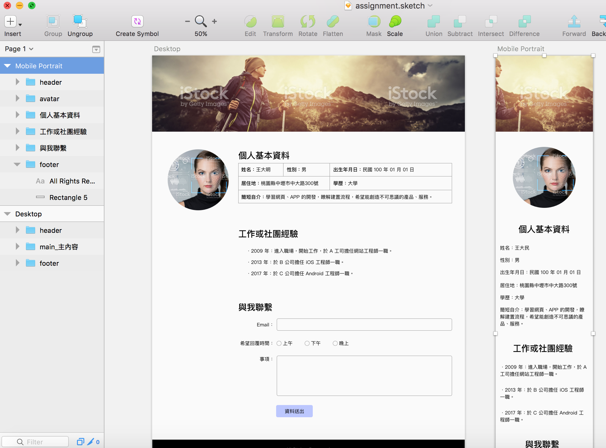
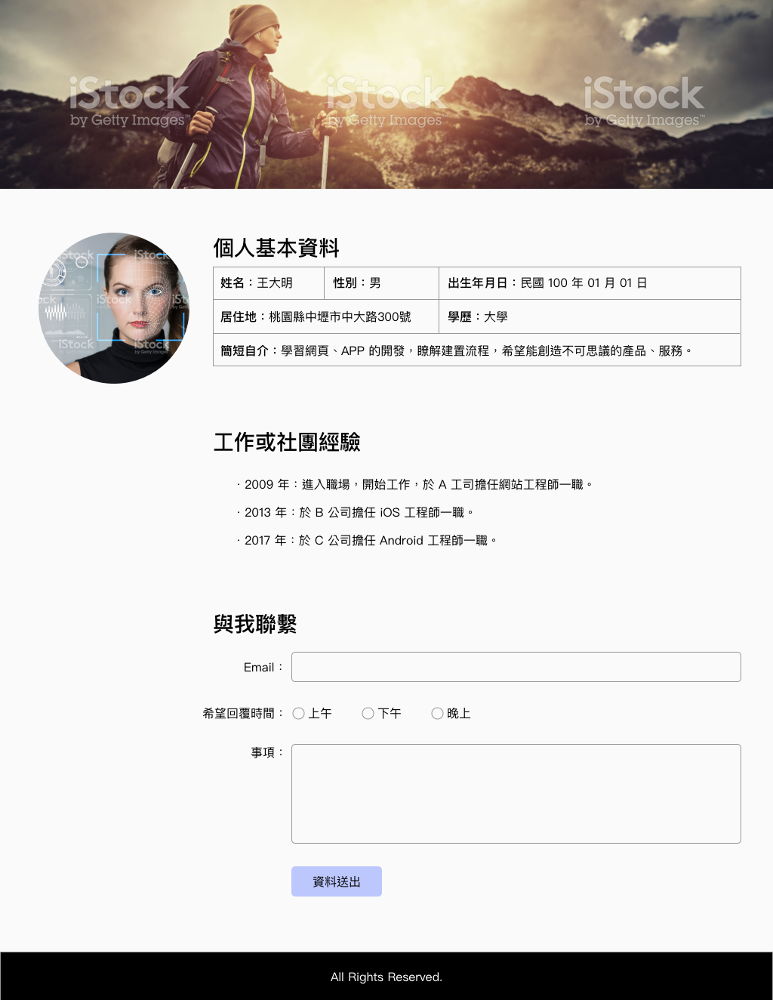
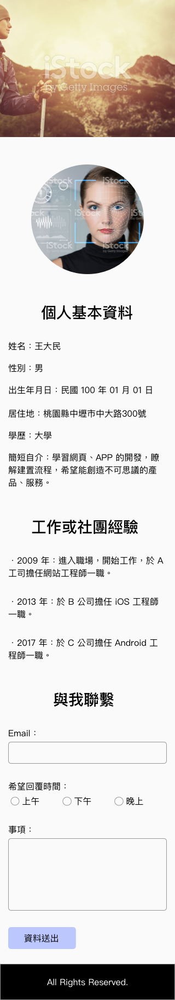

# 5. 作業

## 作業內容

一般會提供如下設計稿：



題目：

1、完成下圖桌機版與行動版的排版，此為同一個頁面做 RWD。\(圖片、內容皆可自行變更\)

2、表單欄位：Email 正規式認證、每個欄位皆必填。 Email 及事項未填：欄位邊框變紅色。

```javascript
// email 驗證
function validateEmail(email) {
  var re = /^(([^<>()\[\]\\.,;:\s@"]+(\.[^<>()\[\]\\.,;:\s@"]+)*)|(".+"))@((\[[0-9]{1,3}\.[0-9]{1,3}\.[0-9]{1,3}\.[0-9]{1,3}\])|(([a-zA-Z\-0-9]+\.)+[a-zA-Z]{2,}))$/;
  return re.test(String(email).toLowerCase());
}
```

說明：

1、最上圖為佔整個螢幕寬度滿版，高度為 250px。

2、設定螢幕寬度為 768px 以上時為桌機版，767px 以下時為行動版。

3、中間整體內容區需頁面置中。

4、[兩張圖片下載](http://notes.carlos-studio.com/download/web_front_end_practice_assignment.zip)。

\(註：以上說明皆非制式，可自由彈性變更。\)

桌機版：



行動版：



## 繳交方式


### 方式一\(優先使用\)：Tibame 後台


### 方式二\(備用\)：上傳至 google drive

進到 google drive 的「TEP101張互賓老師」資料夾。然後依照您的學號建立自己的資料夾，然後將相關檔案上傳至學號資料夾裡。

例：學號為 AP01001，上傳後的結果，如下範例：

* AP01001/index.html
* AP01001/images/
* AP01001/css/
* AP01001/js/


## 參考作法

[https://alldata.sgp1.digitaloceanspaces.com/sample/web\_frontend\_basic\_for\_app\_class\_%E4%BD%9C%E6%A5%AD.zip](https://alldata.sgp1.digitaloceanspaces.com/sample/web_frontend_basic_for_app_class_%E4%BD%9C%E6%A5%AD.zip)


