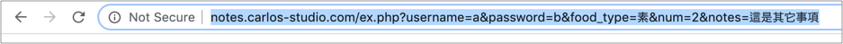
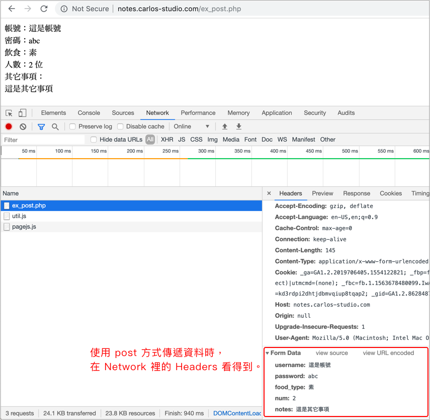
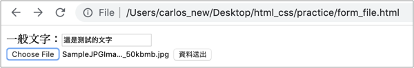
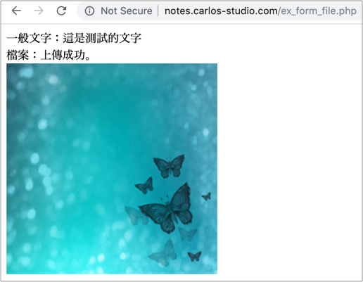

# 2.16 表單2

提供許多欄位，讓使用者填入後，送出資料。

## 基本結構

```markup
<form action="#" method="#">
  ...
</form>
```

**action**：值是一個網址，代表要將使用者填入的資料，送至此網址。

**method**：送資料至 action 所指定的網址，傳送的方式基本上有 **get** 或 **post** 兩種方式。若是 get 的話，表示資料會呈現於網址當中，post 則不會出現在網址當中，相對較安全。

如果表單有要傳送檔案，需增加 enctype 屬性及其值：

```markup
<form action="#" method="#" enctype="multipart/form-data">
  ...
</form>
```

註：以下實際在建立各種表單欄位時，建議都加上 name 這個屬性，屬性值取個有意義的名稱。且都放在 `<form>...</form>` 標籤裡面。

## 表單相關元件

### 文字框：一般文字

* input 標籤不需要結束標籤。

```markup
<input type="text" value="這是預設內容" placeholder="這是提示文字">
```

另可以使用 `<label for="指定id"></label>` 標籤，對應到欄位的 `id`進行點擊的優化：



### 文字框：密碼

```markup
<input type="password" placeholder="請輸入密碼">
```



### 文字框：隱藏

```markup
<input type="hidden" value="123">
```

實際上還是存在，只是使用者看不到，而且該元素也不會佔位。



### 多行文字框

```markup
<textarea rows="3" cols="50" placeholder="提示文字">這裡是文字</textarea>
```

實務上 rows 和 cols 較少用，因為可透過 CSS 來改變。



### 單選

基本結構，通常會搭配 `<label></label>` 標籤一起使用。`checked` 是表示預設要選取。例：

```markup
<input type="radio" value="1" checked>
<label>選項一</label>
```



多個選項時，若要創造單選的介面，則 **name** 要設定成一樣，才會被視為單選．例：

```markup
<input type="radio" name="custom_name" value="1" checked> 是
<input type="radio" name="custom_name" value="2"> 否
```

`checked`：是表示要選取的意思。

註：若有加上 `<label>...</label>` 標籤，有助於使用者的操作方便。

方式一：for 的值，對應到 id 的值。

```markup
<input type="radio" name="food_type_2" id="option1" checked>
<label for="option1">選項一</label>
```

方式二：`<input>` 放在 `<label>…</label>` 裡面。

```markup
<label>
  <input type="radio" name="food_type_3" checked>
  選項一
</label>
```

範例：



### 勾選\(核取方塊\)

基本結構，通常會搭配 `<label></label>` 標籤一起使用。`checked` 是表示預設要選取。例：

```markup
<input type="checkbox" value="1" checked>
<label>興趣1</label>
```



註：同 單選\(radio\)相同，若有加上 `<label>...</label>` 標籤，有助於使用者的操作方便。

方式一：for 的值，對應到 id 的值。

```markup
<input type="checkbox" name="food_type_2" id="option1" checked>
<label for="option1">選項一</label>
```

方式二：`<input>` 放在 `<label>…</label>` 裡面。

```markup
<label>
  <input type="checkbox" name="food_type_3" checked>
  選項一
</label>
```

範例：



### 下拉選單

基本選單：

```markup
<select name="country">
  <option value="1" selected>選項1</option>
  <option value="2">選項2</option>
  <option value="3">選項3</option>
</select>
```

`selected`：表示預設為這項。

分群選單，使用 `<optgroup>...</optgroup>` 包起來：

```markup
<select name="food">
  <optgroup label="第一組">
    <option value="1">選項一</option>
    <option value="2">選項二</option>
  </optgroup>
  <optgroup label="第二組">
    <option value="3">選項三</option>
    <option value="4">選項四</option>
  </optgroup>
</select>
```

在 `<select>` 標籤上使用 **multiple** 屬性可以變成多選



### 一般按鈕

使用 button 標籤，type 屬性設定為 "button"，例：

```markup
<button type="button">這是一般按鈕</button>
```

這種按鈕使用者按了並不會有任何動作，需要再撰寫 JS 去開發相關需求。




### 資料送出按鈕

type 設定為 "submit"，如下兩個例子都可\(使用 button 標籤或 input 標籤\)：

```markup
<button type="submit">這是資料送出按鈕</button>
<!-- 或 -->
<input type="submit" value="這是資料送出按鈕">
```

例：



使用者將這個按鈕按下去之後，會將所在的 form 表單裡的所有欄位資料，送到 form 標籤的 action 網址。

## 範例

```markup
<form action="#" method="get">
  <input type="text" name="address" placeholder="提示文字">

  <br>
  <br>

  <input type="password" name="password">

  <br>
  <br>

  <textarea name="content" rows="5" cols="30">這裡是文字</textarea>

  <br>

  <input type="radio" name="custom_name" value="1"> 是

  <label><input type="radio" name="custom_name" value="2"> 否</label>

  <br>

  <input type="checkbox" name="habits"> 興趣1

  <label><input type="checkbox" name="habits"> 興趣2</label>

  <input type="checkbox" name="habits" id="habit_3"> <label for="habit_3">興趣3</label>

  <br>

  <select name="country">
    <option value="1">選項1</option>
    <option value="2">選項2</option>
    <option value="3">選項3</option>
  </select>

  <br>

  <button type="button">這是一般按鈕</button>

  <br>

  <button type="submit">這是資料送出按鈕(使用 button)</button>
  <!-- 或 -->
  <br>
  <input type="submit" value="這是資料送出按鈕(使用 input)">
</form>
```

結果呈現：



練習，請瞭解上述所有表單元素。


資源：[w3schools input type 類型](https://www.w3schools.com/html/html_form_input_types.asp)

## 資料傳遞方式

### 使用 get 

使用 post 方式傳遞資料時，資料會在網址中呈現，以 `?` 開始，後面的都是資料，以 `&` 符號做區隔。



### 使用 post

使用 post 方式傳遞資料時，在「開發者工具」的 Network → 選擇某支程式 → Headers，Form Data 裡看得到 ：



## 傳遞檔案

* form 標籤的 method 屬性一定要用 post 方式。
* form 標籤，記得加上 `enctype="multipart/form-data"`屬性。

### 語法

```markup
<input type="file">
```

多選

```markup
<input type="file" multiple>
```

### 範例

action 指定為後端已經寫好的程式，此例為：`http://notes.carlos-studio.com/ex_form_file.php`

```markup
<!DOCTYPE html>
<html lang="zh-Hant">
  <head>
    <meta charset="utf-8">
    <title></title>
  </head>
  <body>
    <form action="http://notes.carlos-studio.com/ex_form_file.php" method="post" enctype="multipart/form-data">
      <label>一般文字：</label><input type="text" name="the_text">
      <br>
      <input type="file" name="the_file">
      <button type="submit">資料送出</button>
    </form>
  </body>
</html>
```

產生出來如下圖：



按下資料送出後，如果有傳送成功，會出現如下圖，你所打的文字及所傳的圖片：




