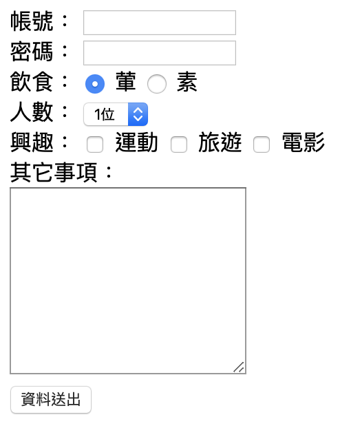
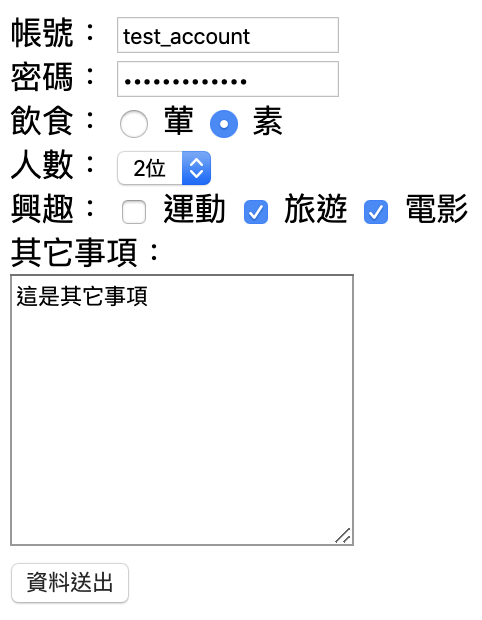
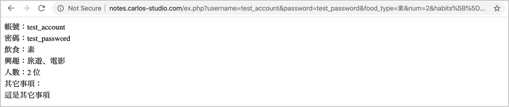

# 2.17 表單練習

## 練習一：傳遞資料

請建立 `form.html` 檔案。

注意事項：

* form 標籤的 action 屬性，設定成 `http://notes.carlos-studio.com/ex.php`。method 屬性，設定成 `get`。
* 帳號 name="username"；密碼 name="password"；飲食 name="food\_type"，「葷」 這個的 value 請設定成「葷」；「素」 這個的 value 請設定成「素」。
* 人數 name="num" 的下拉選單，建立「1位」、「2位」、「3位」。分別 option 的value 為 1、2、3。
* 興趣：input 的 `type="checkbox"`，`name="habits[]"`，value 分別是 **`運動`**、**`旅遊`**、**`電影`**。
* 其它事項 name="notes"。
* 飲食 radio button 及興趣 checkbox，請優化點擊範圍，點擊文字，也要能選得到。
* 資料送出的按鈕，type 設定成 `submit`。
* 密碼欄位，type 為 `password`。

完成示意圖：



例如帳號部份：

```markup
<div>
  <label for="username">帳號：</label>
  <input type="text" id="username" name="username">
</div>
```


假設輸入以下資料，點擊「資料送出」按鈕後：



結果應如下圖\(觀察網址\)：



參考：[Percent-encoding](https://en.wikipedia.org/wiki/Percent-encoding)

`%20`：網址上若出現，代表空格的意思。


### 參考作法

[https://alldata.sgp1.digitaloceanspaces.com/sample/html\_css\_assignment1.zip](https://alldata.sgp1.digitaloceanspaces.com/sample/html_css_assignment1.zip)

### 觀察 post 資料傳遞

form 標籤的 action 屬性，請改成 `http://notes.carlos-studio.com/ex_post.php`。method 屬性，設定成 `post`。


## 練習二：傳遞檔案

建立檔案名稱：`form_post_file.html`

* 建立一個 form 表單，action 指定為 `http://notes.carlos-studio.com/ex_form_file.php` ，method 為 `post` ，enctype 為 `multipart/form-data` 。
* 建立一個一般文字欄位\( `type="text"` \)，name 指定為 `the_text` 。
* 建立一個檔案欄位\( `type="file"` \)， name 指定為 `the_file` 。
* 最後建立一個送出的按鈕：`<button type="submit">資料送出</button>` 。

原始碼如下：

```markup
<!DOCTYPE html>
<html lang="zh-Hant">
  <head>
    <meta charset="utf-8">
    <title></title>
  </head>
  <body>
    <form action="http://notes.carlos-studio.com/ex_form_file.php" method="post" enctype="multipart/form-data">
      <label>一般文字：</label><input type="text" name="the_text">
      <br>
      <input type="file" name="the_file">
      <button type="submit">資料送出</button>
    </form>
  </body>
</html>
```

產生出來的結果如下圖：


按下資料送出後，如果有傳送成功，會出現如下圖，你所打的文字及所傳的圖片：


