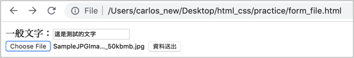
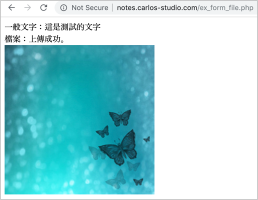

# 2.17 表單練習

## 練習一：傳遞資料

請建立 `form.html` 檔案。

注意事項：

* form 標籤的 action 屬性，設定成 `http://notes.carlos-studio.com/ex.php`。method 屬性，設定成 `get`。
* 帳號 name="username"；密碼 name="password"；飲食 name="food\_type"，「葷」 這個的 value 請設定成「葷」；「素」 這個的 value 請設定成「素」。
* 人數，name="num"，的下拉選單，建立「1位」、「2位」、「3位」。分別 option 的value 為 1、2、3。
* 其它事項 name="notes"。
* 飲食 radio button，請優化點擊範圍，點擊文字，也要能選得到。
* 資料送出的按鈕，type 請設定成 `submit`。
* 密碼欄位，type 為 password。

假設輸入以下資料，點擊「資料送出」按鈕後：

結果應如下圖\(觀察網址\)：

## 練習二：傳遞檔案

建立檔案名稱：`form_post_file.html`

* 建立一個 form 表單，action 指定為 `http://notes.carlos-studio.com/ex_form_file.php` ，method 為 `post` ，enctype 為 `multipart/form-data` 。
* 建立一個一般文字欄位\( `type="text"` \)，name 指定為 `the_text` 。
* 建立一個檔案欄位\( `type="file"` \)， name 指定為 `the_file` 。
* 最後建立一個送出的按鈕：`<button type="submit">資料送出</button>` 。

產生出來的結果如下圖：

按下資料送出後，如果有傳送成功，會出現如下圖，你所打的文字及所傳的圖片：

