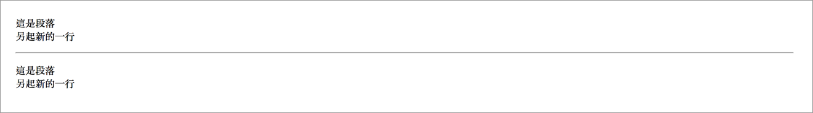

# 2.5 斷行與水平分隔線

共同特性：**沒有結束標籤**。

## 斷行 - &lt;br&gt;

`<br>`：**br**eak 的縮寫。

語意：表示在另起新的一行。

範例：

```markup
<p>這是段落<br>另起新的一行</p>
```

結果呈現：


## 水平分隔線 - &lt;hr&gt;

`<hr>`：**h**orizontal **r**ule 的縮寫。

範例：

```markup
<p>這是段落<br>另起新的一行</p>
<hr>
<p>這是段落<br>另起新的一行</p>
```

結果呈現：

