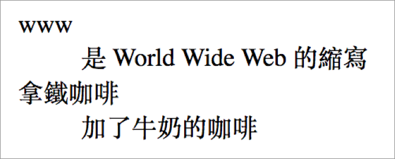

# 2.9 清單

`<dl>`：**d**efinition **l**ist

`<dt>`：**d**efine **t**erm

`<dd>`：**d**efinition **d**escription

範例：

```markup
<dl>
  <dt>www</dt>
  <dd>是 World Wide Web 的縮寫</dd>
  <dt>拿鐵咖啡</dt>
  <dd>加了牛奶的咖啡</dd>
</dl>
```

結果呈現：



