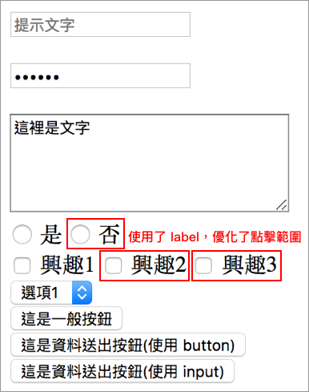

# 2.16 表單

提供許多欄位，讓使用者填入後，送出資料。

## 基本結構

```markup
<form action="#" method="#">
  ...
</form>
```

**action**：值是一個網址，代表要將使用者填入的資料，送至此網址。

**method**：送資料至 action 所指向的網址，傳送的方式基本上有 **get** 或 **post** 兩種方式。若是 get 的話，表示資料會呈現於網址當中，post 則不會出現在網址當中，相對較安全。

get 範例：[http://carlos-studio.com/?address=abc&zone-234](http://carlos-studio.com/**?address=abc&zone-234**`)，資料以 **?** 做開始，以 **&** 做分隔。所以 address 是欄位名稱\(name\)，**=** 後面緊接著是 address 的值，

## 文字框

```markup
<input type="text" name="address" value="這是內容" placeholder="提示文字">
```




## 文字框：密碼

```markup
<input type="password" name="the_password">
```

## 文字框：隱藏

```markup
<input type="hidden" name="the_hide_data">
```

## 多行文字框

```markup
<textarea name="content" rows="3" cols="50" placeholder="提示文字">這裡是文字</textarea>
```

實務上 rows 和 cols 較少用，因為可透過 CSS 來改變。

## 單選

**name** 要一樣，才能被視為單選：

```markup
<input type="radio" name="custom_name" value="1" checked> 是
<input type="radio" name="custom_name" value="2"> 否
```

`checked`：是表示要選取的意思。

註：若有加上 `<label>...</label>` 標籤，有助於使用者的操作方便。

方式一：for 的值，對應到 id 的值。

```markup
<input type="radio" name="food_type_2" id="option1" checked>
<label for="option1">選項一</label>
```

方式二：`<input>` 放在 `<label>…</label>` 裡面。

```markup
<label>
  <input type="radio" name="food_type_3" checked>
  選項一
</label>
```

範例：




## 勾選\(核取方塊\)

```markup
<input type="checkbox" name="habits" checked> 興趣1
```

`checked`：勾選。

註：若有加上 `<label>...</label>` 標籤，有助於使用者的操作方便。

## 下拉選單

```markup
<select name="country">
  <option value="1" selected>選項1</option>
  <option value="2">選項2</option>
  <option value="3">選項3</option>
</select>
```

`selected`：表示預設為這項。

## 按鈕

```markup
<button type="button">這是一般按鈕</button>
```

## 資料送出按鈕 - submit

```markup
<button type="submit">這是資料送出按鈕</button>
<!-- 或 -->
<input type="submit" value="這是資料送出按鈕">
```

## 練習

檔案所在路徑：`html/2.16/index.html`

```markup
<form action="#" method="get">
  <input type="text" name="address" placeholder="提示文字">

  <br>
  <br>

  <input type="password" name="password">

  <br>
  <br>

  <textarea name="content" rows="5" cols="30">這裡是文字</textarea>

  <br>

  <input type="radio" name="custom_name" value="1"> 是

  <label><input type="radio" name="custom_name" value="2"> 否</label>

  <br>

  <input type="checkbox" name="habits"> 興趣1

  <label><input type="checkbox" name="habits"> 興趣2</label>

  <input type="checkbox" name="habits" id="habit_3"> <label for="habit_3">興趣3</label>

  <br>

  <select name="country">
    <option value="1">選項1</option>
    <option value="2">選項2</option>
    <option value="3">選項3</option>
  </select>

  <br>

  <button type="button">這是一般按鈕</button>

  <br>

  <button type="submit">這是資料送出按鈕(使用 button)</button>
  <!-- 或 -->
  <br>
  <input type="submit" value="這是資料送出按鈕(使用 input)">
</form>
```

結果呈現：



