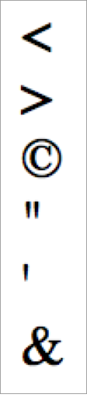

# 2.18 HTML Entity\(實體\)

如遇特殊符號，可嚐試使用 HTML Entity 來顯示，例：

```markup
<body>
  &lt;
  <br>
  &gt;
  <br>
  &copy;
  <br>
  &quot;
  <br>
  &apos;
  <br>
  &amp;
</body>
```

結果呈現：



## 資源

[更多 HTML Entities \(https://www.w3schools.com/html/html\_entities.asp\)](https://www.w3schools.com/html/html_entities.asp)

