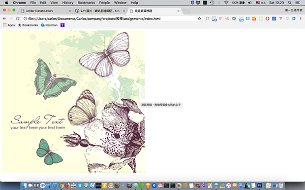

# 2.11 圖片

``：src 為圖片的路徑。

`` 為 **im**a**g**e 的縮寫。

## 語意

圖片的意思

## 常用屬性

```markup

```

## 範例 1

正常圖片顯示，以及滑鼠移過後，出現 **title** 的文字。

```markup

```

結果呈現



## 路徑

絕對路徑：

```markup

<!-- 或 -->

```

相對路徑：

```markup

<!-- 或 -->

```

**..**：代表上一層資料夾

**.**：代表當前資料夾

## 範例 2

圖片末正常出現時，顯示 **alt** 的文字。

```markup

```

結果呈現


## 練習

檔案所在路徑：`html/2.11/index.html`

請練習在網頁上呈現圖片，並瞭解 **alt**、**title** 的差異，以及 **src** 路徑方式的使用。

