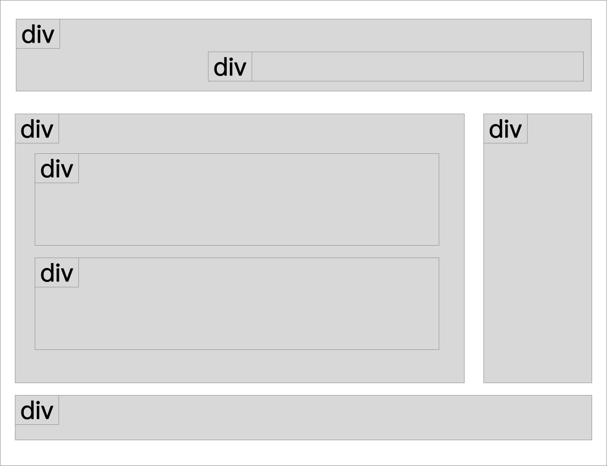
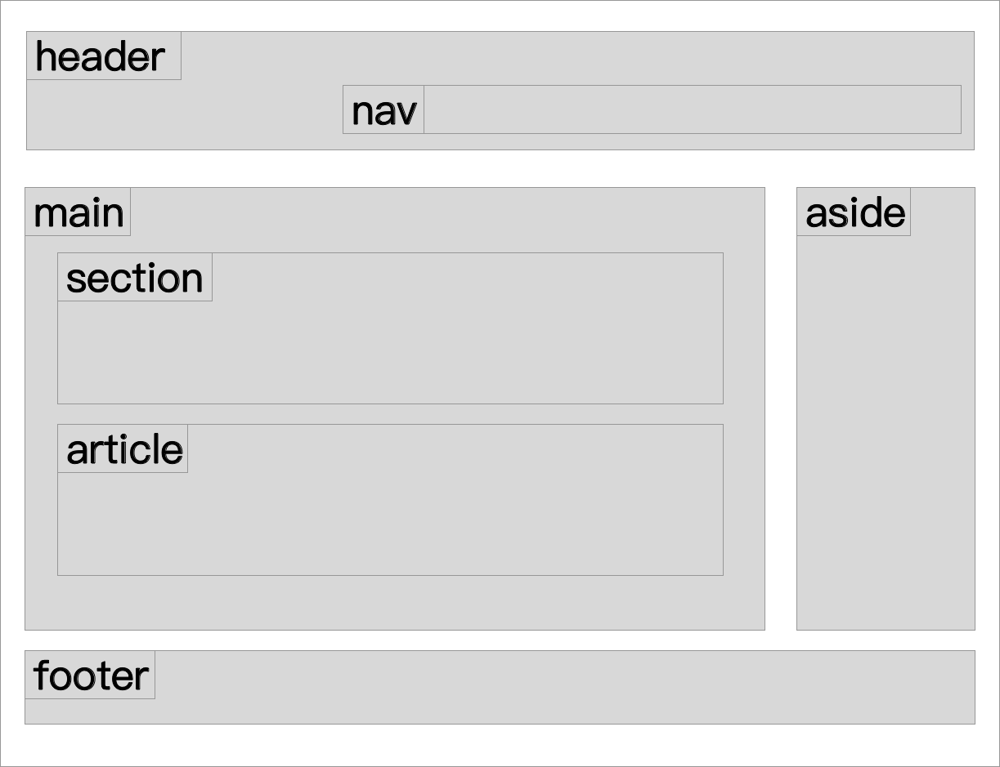

# 2.15 有結構的語意元素

頁首 - `<header>…</header>`

頁尾 - `<footer>…</footer>`

導覽 - `<nav>…</nav>`

頁面主內容 - `<main>…</main>`：一個網頁只能有一個 `<main>...</main>` 標籤。

獨立區塊 - `<article>…</article>`：表示是獨立的區塊，可在網頁任意地方重覆出現。

頁面區段 - `<section>…</section>`

側邊欄 - `<aside>…</aside>`

## 結構的轉換

在還沒有 HTML5 之前，是單純使用 `
` 來創造頁面的各個區塊，如下圖：

但 `
` 本身是沒有語意的，不利於 SEO。所以在 HTML5 開始之後，有了新的規範，讓以上各個頁面區塊，重新賦予實際的意義：

這樣就能更加瞭解各個頁面的區塊實際上所代表的意涵。

