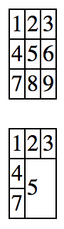

# 2.12 表格

## 語意

即表格之意。

`<table>`

`<tr>`：**t**able **r**ow 的縮寫。

`<td>`：**t**able **d**ata 的縮寫。

`<th>`：**t**able **h**eading 的縮寫。

`<thead>`：**t**able **head** 的縮寫。

`<tfoot>`：**t**able **foot** 的縮寫。

`<tbody>`：**t**able **body** 的縮寫。

## 結構

基本結構 1

```markup
<table>
  <tr>
    <td></td>
    <td></td>
  </tr>
  <tr>
    <td></td>
    <td></td>
  </tr>
</table>
```

基本結構 2

```markup
<table>
  <tr>
    <th></th>
    <th></th>
  </tr>
  <tr>
    <td></td>
    <td></td>
  </tr>
</table>
```

進階結構

```markup
<table>
  <thead>
    <tr>
      <th></th>
      <th></th>
    </tr>
  </thead>
  <tbody>
    <tr>
      <td></td>
      <td></td>
    </tr>
  </tbody>
  <tfoot>
    <tr>
      <td></td>
      <td></td>
    </tr>
  </tfoot>
</table>
```

## 範例 1

```markup
<table>
  <tr>
    <td>第一列第一欄</td>
    <td>第一列第二欄</td>
  </tr>
  <tr>
    <td>第二列第一欄</td>
    <td>第二列第二欄</td>
  </tr>
</table>
```

結果呈現


## 範例 2

```markup
<table>
  <tr>
    <th>標題一</th>
    <th>標題二</th>
  </tr>
  <tr>
    <td>第一列第一欄</td>
    <td>第一列第二欄</td>
  </tr>
  <tr>
    <td>第二列第一欄</td>
    <td>第二列第二欄</td>
  </tr>
</table>
```

結果呈現


## 範例 3

```markup
<table>
  <thead>
    <tr>
      <th>標題一</th>
      <th>標題二</th>
    </tr>
  </thead>
  <tbody>
    <tr>
      <td>第一列第一欄</td>
      <td>第一列第二欄</td>
    </tr>
    <tr>
      <td>第二列第一欄</td>
      <td>第二列第二欄</td>
    </tr>
  </tbody>
  <tfoot>
    <tr>
      <td>tfoot 第一欄</td>
      <td>tfoot 第二欄</td>
    </tr>
  </tfoot>
</table>
```

結果呈現


## rowspan 與 colspan 合併欄位

* rowspan：以「列\(橫\)」的方式來算，合併幾個欄位。
* colspan：以「行\(直\)」的方式來算，合併幾個欄位。

```markup
<table>
  <tr>
    <td>第一列第一欄</td>
    <td>第一列第二欄</td>
  </tr>
  <tr>
    <td>第二列第一欄</td>
    <td>第二列第二欄</td>
  </tr>
</table>
```


```markup
<table>
  <tr>
    <td rowspan="2">第一列第一欄</td>
    <td>第一列第二欄</td>
  </tr>
  <tr>
    <td>第二列第二欄</td>
  </tr>
</table>
```


```markup
<table>
  <tr>
    <td colspan="2">第一列第一欄</td>
  </tr>
  <tr>
    <td>第二列第一欄</td>
    <td>第二列第二欄</td>
  </tr>
</table>
```


## 練習

檔案所在路徑：`html/2.12/index.html`

試著畫出下方表格：



