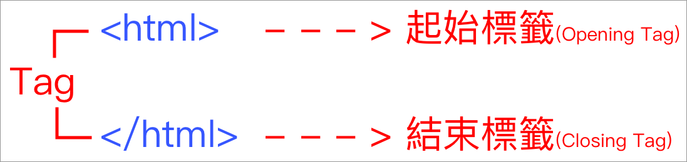
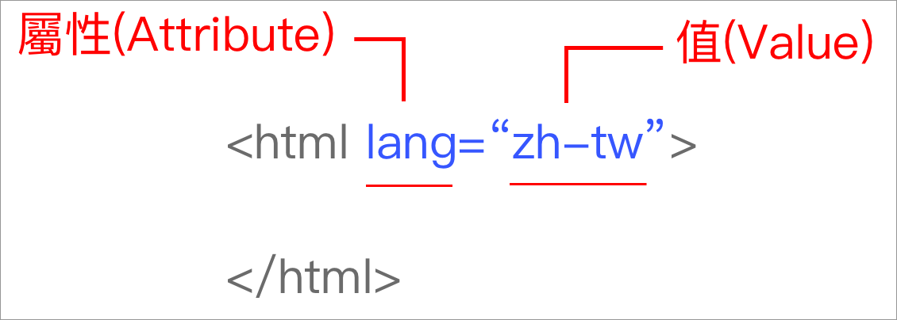
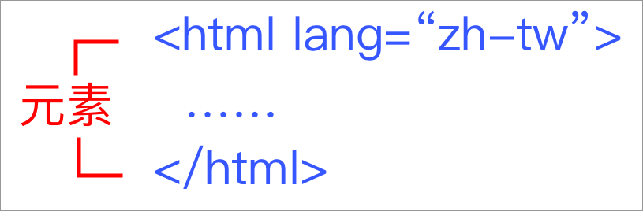

# 2.1 宣告、標籤、屬性、元素

## 宣告\(Declaration\)

~~HTML 4.01 Strict~~

```markup
<!DOCTYPE HTML PUBLIC "-//W3C//DTD HTML 4.01//EN" "http://www.w3.org/TR/html4/strict.dtd">
```

~~XHTML 1.0 Strict~~

```markup
<!DOCTYPE html PUBLIC "-//W3C//DTD XHTML 1.0 Strict//EN" "http://www.w3.org/TR/xhtml1/DTD/xhtml1-strict.dtd">
```

**HTML 5**

```markup
<!DOCTYPE html>
```

## 標籤\(Tags\)



## 屬性\(Attributes\)



## 元素\(Elements\)



## 撰寫原則及基本觀念

* 所有標籤一律小寫。
* 多個連續空格，瀏覽器會視為只有一個空格。
* 避免有標籤交叉的狀況。例：`<p>這是文章段落，<div>另外</p>一段落。</div>`
* 縮排一律用 2 個空格或 4 個空格。
* &lt;html&gt; 標籤內只有 &lt;head&gt; 和 &lt;body&gt; 兩個標籤。
* `<html>` 是 `<head>` 及 `<body>` 的**父元素**；相反地，`<head>` 及 `<body>` 是 `<html>` 的**子元素**。

