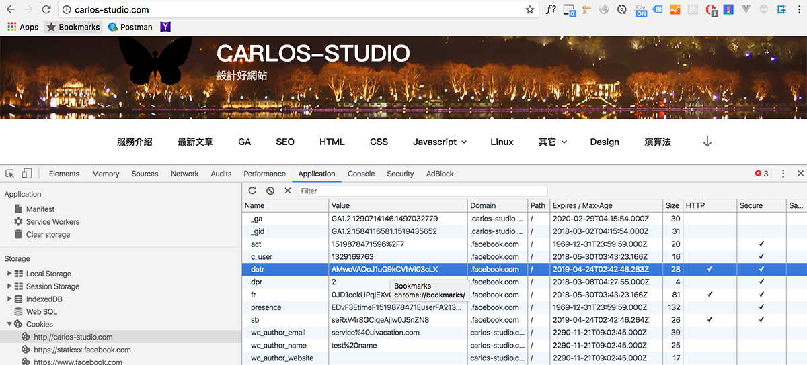
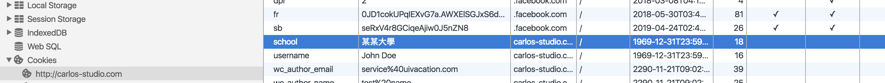
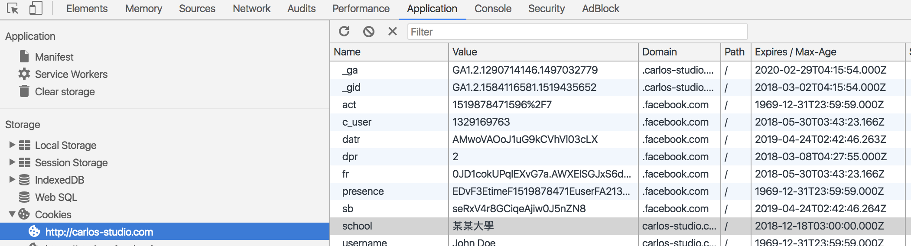

# 4.3.3 儲存機制 - cookie


## 什麼是 Cookie？

Cookie 是網站在您瀏覽網頁時儲存在您的電腦上的資料。

Cookie 可用於儲存各種資訊，包含個人識別資訊（例如姓名、id……等等）。

## 在哪裡可看到 cookie 資訊？

以 Chrome 瀏覽器為例：如下圖\(`cmd + option + i`，切換到 Application 頁籤\)



## 使用 JS 建立 cookie

本地端 file:// 模式無法測試，可隨意開啟任意網站來測試：

```javascript
document.cookie = "school=某某大學";
```

通常沒有設定過期的時間的話，整個結束瀏覽器的話，該 cookie 就會自動被刪除。



## 設定 cookie 的過期時間

```javascript
document.cookie = "school=某某大學; expires=Thu, 18 Dec 2018 03:00:00 UTC";
```



Unix timestamp：1970年1月1日0時0分0秒起至現在的總秒數。

## 更改 cookie 的值

與建立 cookie 的語法是一樣的，只要 cookie 的名稱相同，就會直接更改相同名稱的 cookie。

## 刪除 cookie

只要為cookie指定「過去的時間」即可刪除。

例：

建立一個名稱為 school 的 cookie，過期時間定為 `Thu, 18 Dec 2018 03:00:00 UTC`

```javascript
document.cookie = "school=某某大學; expires=Thu, 18 Dec 2018 03:00:00 UTC";
```

若要將 school 刪除\(改成 2017 年即可直接刪除\)：

```javascript
document.cookie = "school=某某大學; expires=Thu, 18 Dec 2017 03:00:00 UTC";
```

## 取得 cookie 的值

```javascript
document.cookie
```

但這個會取得所有的 cookie 值。例如有兩個 cookie，分別是：

* school='某某大學'
* school\_another='另一間'

document.cookie 就會取得 `"school=某某大學; school_another=另一間"`。

其實不方便使用。

另有現成的函式，可方便直接取得 cookie 的值：

```javascript
function getCookie(cname) {
    var name = cname + "=";
    var ca = document.cookie.split(';');
    for(var i = 0; i < ca.length; i++) {
        var c = ca[i];
        while (c.charAt(0) == ' ') {
            c = c.substring(1);
        }
        if (c.indexOf(name) == 0) {
            return c.substring(name.length, c.length);
        }
    }
    return "";
}
```

就可以直接使用 getCookie\(\) 函式來取得 cookie 的值：

```javascript
var my_cookie = getCookie('school');
```

w3schools 已有整理好幾個與 cookie 相關函式，是一般常用到的： [https://www.w3schools.com/js/js\_cookies.asp](https://www.w3schools.com/js/js_cookies.asp)

## 注意事項

cookie 是有網域及路徑上的限定，無法取得其它網站的 cookie。

cookie 的 path 若有指定的話，其他路徑會無法取得。

例如：設定了一個 cookie，其 path 是在 `/category`，那麼在首頁就會無法取得該 cookie，只有在 `/category` 路徑下才能取得資料。

