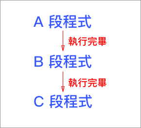
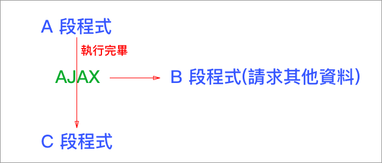
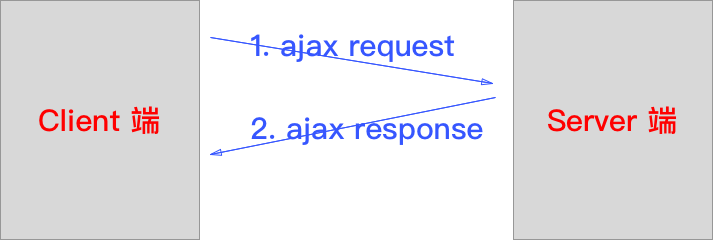
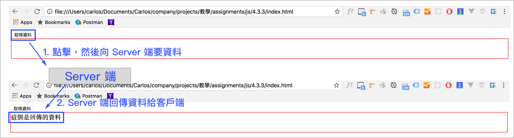

# 4.3.2 非同步技術 AJAX - 使用 jQuery

AJAX = **A**synchronous **J**avaScript **a**nd **X**ML。

## 同步資料請求

在程式的執行過程當中，一定要是一個接著一個，例如：第一行程式執行完後才會執行第2行。



例 1：for 迴圈跑完了5次之後，才會執行 `alert("done");`。絕對不可能先跑 `alert("done");`。

```javascript
for(var i = 0; i < 5; i++){
  alert(i);
}
alert("done");
```

例 2：下載的先後順序，jquery 會先請求下載，再來才是 bootstrap 程式。

且一定是 jQuery 程式執行完後，才會執行 bootstrap.js 程式。

```markup
<!doctype html>
<html>
  <head>
    <script type="text/javascript" src="./js/jquery-1.11.1.min.js"></script>
    <script type="text/javascript" src="./js/bootstrap.js"></script>
  </head>
  <body>
  </body>
</html>
```

## 非同步資料請求

運作原理：



B 段程式與 C 段程式，沒有先後的相依性，幾乎是同時執行\(或者B或C先執行\)。

因為 AJAX 非同步資料請求技術的問題，使用網頁局部刷新內容變得可以實現。

## 使用 jQuery 實作 AJAX

jQuery 將原來需要寫很多行的 JavaScript，包裝成單一函式，便於使用。

```javascript
$.ajax({
  url: 'http://notes.carlos-studio.com/ajax/example.php', // 將資料傳送出去的網址
  type: 'get',                                            // 也可以是 post
  data: 'a=1',                                            // 傳遞的參數
  dataType: 'json',                                       // 傳回來的資料類型
  success: function(data){                                // 成功接收到資料後，會執行的函式
    //console.log(data);
    $("#get_data").html(data.value);
  },
  statusCode: {                                           // 依據伺服器端回傳的狀態碼，來顯示錯誤訊息
    500: function() {
      alert( "500 伺服器端錯誤" );
    }
  }
});
```

## 完整範例

檔案所在路徑：`js/4.3.2/index.html`

線上範例：[http://notes.carlos-studio.com/web\_learn/ajax/4.3.3/index.html](http://notes.carlos-studio.com/web_learn/ajax/4.3.3/index.html)

php

```php
<?php
header('Access-Control-Allow-Origin: *');
$arr = array('value' => "這個是回傳的資料");

echo json_encode($arr); // 產生：{"value":"這個是回傳的資料"}
?>
```

HTML 和 JavaScript

```javascript
<!doctype html>
<html>
  <head>
    <meta charset="utf-8">
    <title>jQuery AJAX</title>
  </head>
  <body>
    <button type="button" id="the_button">取得資料</button>
    <div id="get_data"></div>

    <script src="https://ajax.googleapis.com/ajax/libs/jquery/3.3.1/jquery.min.js"></script>

    <script>
      $("#the_button").on("click", function(){
        $.ajax({
          url: 'http://notes.carlos-studio.com/ajax/example.php', // 將資料傳送出去的網址
          type: 'get',                                            // 也可以是 post
          data: 'a=1',                                            // 傳遞的參數
          dataType: 'json',                                       // 傳回來的資料類型
          success: function(data){                                // 成功接收到資料後，會執行的函式
            //console.log(data);
            $("#get_data").html(data.value);
          },
          statusCode: {                                           // 依據伺服器端回傳的狀態碼，來顯示錯誤訊息
            500: function() {
              alert( "500 伺服器端錯誤" );
            }
          }
        });
      });
    </script>
  </body>
</html>
```

執行原理



結果呈現



## 其它資源

[jQuery 的 Ajax 完整官網資源](http://api.jquery.com/jQuery.ajax/)

