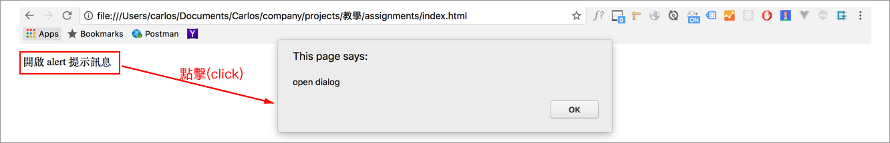

# 4.1.1 套用 javascript

套用 JS，讓原來沒有任何**行為**的 html，加上一些互動效果，使之可與使用者互動。主要常用的 JS 套用方式有以下幾種：

## 方式一：行內套用

直接使用一些屬性，加在 html 的標籤內。但因為這樣會使得 html 過於雜亂，且通常 JS 程式碼較多，建議少用此種套用方式。

```markup
<p onclick="alert('open dialog');">開啟 alert 提示訊息</p>
```



## 方式二：嵌入套用

在 html 當中，寫在 `<script>...</script>` 之中。可以在頁面的任何地方出現，但建議一般會放在 `</body>` 結束標籤之前，這樣在內容出現時，元素才會被套用到 JS 的行為。

```markup
<body>
  <p>開啟 alert 提示訊息</p>

  <script type="text/javascript">
    var p = document.getElementsByTagName("p")[0];
    p.addEventListener("click", function(){
      alert("open dialog");
    });
  </script>
</body>
```

練習：試著將 `<script>...</script>` 移到 `<head></head>` 區段之中，看是否正常？

## 方式三：外部套用

一般來說，html、js，會建議寫在各自的檔案，以讓 html 儘可能保持乾淨不雜亂。例：

* index.html
* js/index.js

**index.js** 的內容如下：

```javascript
var p = document.getElementsByTagName("p")[0];
p.addEventListener("click", function(){
  alert("open dialog");
});
```

而 **index.html** 要載入 **index.js** 這個外部檔案的方式如下：

```markup
<body>
  <p>開啟 alert 提示訊息</p>

  <script src="./js/index.js"></script>
</body>
```

注意 `<script>...</script>` 是**有**結尾標籤的。**src** 是 **source** 的縮寫。

