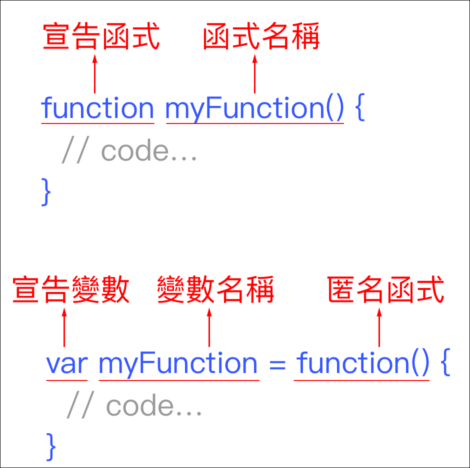
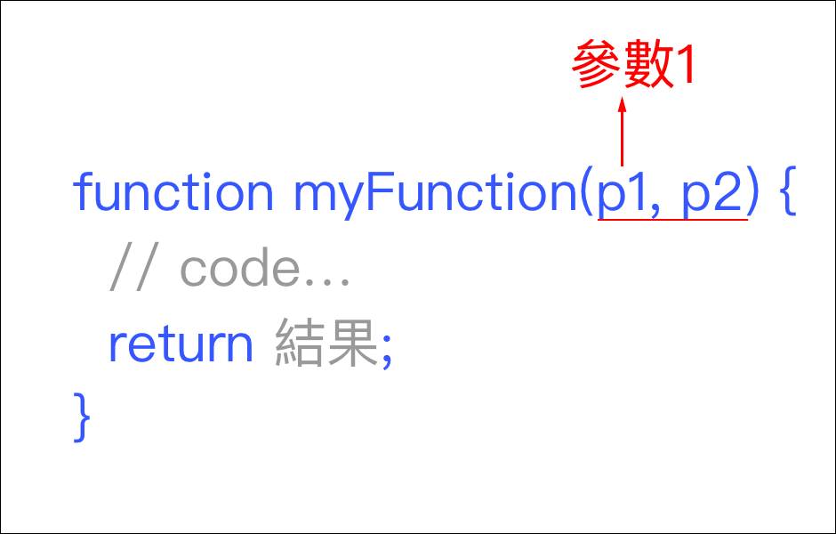

# 4.1.8 函式\(function\)

## 什麼是函式

多行的程式，組合在一起，變成一段 Code，可重覆在多處使用。

## 建立函式



## 呼叫函式

範例：

```javascript
// 宣告一個匿名函式，存在 myFunction 變數裡
var myFunction = function(){
  // 其它程式
};

// 呼叫方式 1
myFunction();

// 呼叫方式 2：若有回傳值，指定 result 變數來承接
var result = myFunction();
```

## 傳遞參數及回傳結果



## 練習一

檔案所在路徑：`js/4.1.8/index.html`

於瀏覽器中執行，並觀察程式的執行流程、函數的使用：

```javascript
<!doctype html>
<html>
  <head>
    <meta charset="utf-8">
    <title>這是網頁標題</title>

  </head>
  <body>

    <script type="text/javascript">
      var a = 1;
      var b = 2;

      function add(){
        a = a + 1; // a 結果變成 2
        b = b + 1; // b 結果變成 3
        alert(a+b); // 5
      }
      add(); // 執行 add() 函式

      var multiple = function(){
        a = a * 2; // a 結果變成 4
        b = b * 2; // b 結果變成 6
        alert(a*b); // 24
      };
      multiple(); // 執行 multiple() 函式

      var minus_one = function(x, y){
        x = x - 1; // x 結果 是 3
        y = y - 1; // y 結果 是 5
        return x - y; // 回傳 -2
      };
      
      var c = minus_one(a, b); // 執行 minus_one() 函式，並將回傳值賦予變數 c，所以 c 會是 -2
      alert(c);
    </script>

  </body>
</html>
```


## 練習二：寫一個函式，將指定文字左邊補零

寫一個函式叫 strpad\(\)，帶兩個參數。

* 第一個參數：任何正整數。
* 第二個參數：指定位數，若不足的話，左邊補 0。


例如以下，要輸出 09：

```javascript
// str_pad 函式寫在這


var result = str_pad(9, 2);
console.log(result); // 09
```


my\_num.toString\(\)：可以將整數值變成字串。

my\_num.length ：可以取得字串長度。


參考作法：




