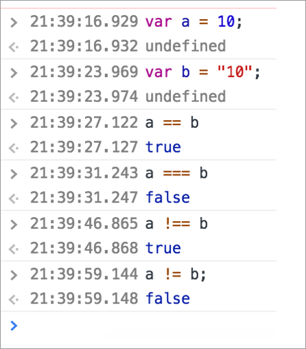
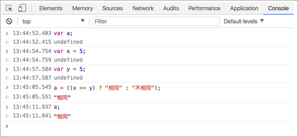

# 4.1.5 邏輯\(logic\)

變數型態：**布林值\(Boolean\)**：**true** 或 **false**

指的是一個變數，可以存放 **true** 或 **false**，表示該變數是一個布林值。例：

```javascript
var a = true;
var b = false;
```

## 比較運算子\(Comparison Operators\)

`===`：「值」、「型態」都要一樣，才會視為 **true**。例：`10 === "10"`，結果為 **false**。

!==：「值」、「型態」都要不一樣，才會視為 **true**。例：`10 !== "10"`，結果為 **true**。

`==`：「值」只要一樣，結果即會被視為 **true**。例：`10 == "10"`，結果為 **true**。

`!=`：「值」只要不一樣，結果即會被視為 **true**。例：`10 != "10"`，結果為 **false**。

`>`：大於。例： `5 > 3`，結果為 **true**。

`<`：小於。例：`5 < 3`，結果為 **false**。

`>=`：大於等於。例：`5 >= 3`，結果為 **true**。

`<=`：小於等於。例：`5 <= 3`，結果為 **false**。

## 邏輯運算子\(Logical Operators\)

假設： x = 6、y = 3。

`&&`：且。例：**\(x &lt; 10 && y &gt; 1\)** 的結果會是 **true**。與`&`的差異？`&&` 效能較好，因為第一個判斷若為 false 的話，就會直接忽略第 2 個的判斷。

`||`：或。例：**\(x == 5 \|\| y == 5\)** 的結果會是 **false**。**\(x == 6 \|\| y == 5\)** 的結果會是 **true**。與`|`的差異？ `||` 效能較好，因為第一個判斷若為 true 的話，就會直接忽略第 2 個的判斷。

`!`：非。例：**!\(x == y\)** 的結果會是 **true**。

## 三元運算子\(?:\)

```javascript
var a;
a = ( (比較結果) ? value1 : value2 );
```

如果 **比較結果** 是 **true**，則變數 a 的值就等於 **value1**。

如果 **比較結果** 是 **false**，則變數 a 的值就等於 **value2**。

## 練習1

請在瀏覽器中的 console 中輸入來練習。`cmd + option + i` 即可開啟瀏覽器中的 console。

如下範例，結果示意：



## 練習2

試試三元運算子，瞭解語法即可：



