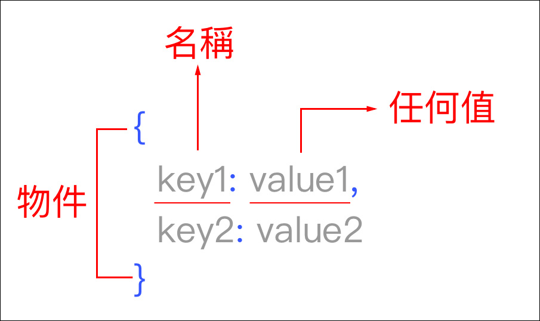

# 4.1.9 物件\(Object\)

## 結構語法



「**任何值**」可以是數值、函式、字串、物件等任何 JavaScript 合法的型態都可。

## 觀念

任何人、事、物都可以是物件\(Object\)，都有自己的屬性及動作。

以車子為例，車子本身就是一個物件，屬性有廠牌名稱、重量等；可以執行的動作有開車、停車等。

## 練習：瞭解 dot syntax

檔案所在路徑：`js/4.1.9/index.html`

瞭解物件結構，以及如何使用物件：

```javascript
var car = {
  brand_name: "toyota",
  weight: "500kg",
  doors: 4,
  drive: function(){
    alert("drive");
  },
  stop: function(){
    alert("stop");
  }
};

car.drive();
car.stop();
alert(car.brand_name);
```

其它語法撰寫模式，以下範例寫法結果是與上面相同的：

```javascript
var car = {}; // 宣告 car 為一個空的物件
car.brand_name = "toyota";
car.weight = "500kg";
car.doors = 4;
car.drive = function(){
  alert("drive");
};
car.stop = function(){
  alert("stop");
};

car.drive();
car.stop();
alert(car.brand_name);
```

