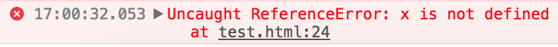

# 4.1.11 變數可視範圍\(scope\)

一個變數的可視範圍，指的是哪些程式可以存取該變數。

所以當宣告了一個變數之後，要能夠區別該變數的 scope。

## 範例 1：先後順序

```javascript
alert(a); // 會跳出提示訊息，內容為 undefined。因為在這行之前，a 並沒有被宣告成變數過。
var a = 10;
```

## 範例 2

a 為全域變數

```javascript
var a = 10;
function add_number(){
  a = a + 10;
}
add_number();
alert(a); // 跳出提示訊息，結果 a 是 20。
```

## 範例 3

函式裡的 a 及 x ，在函式外就不存在。

```javascript
var a = 10;
function add_number(x){
  var a = x + 10;
  alert(a); // 跳出提示訊息，結果 a 是 20。
}
add_number(a);
alert(a); // 跳出提示訊息，結果 a 是 10。
```

## 範例 4

```javascript
var a = 10;
function add_number(x){
  a = x + 10;
}
add_number(a);
alert(a); // 跳出提示訊息，結果 a 是 20。
alert(x); // 在 console 中，會出現 x is not defined 的錯誤訊息。
```



## 範例 5：傳值呼叫\(Call by Value\)

在傳遞參數時，只會複製其值至參數之中。

```javascript
var a = 10;
function add_number(a){ // 這裡的 a 是函式內的區域變數
  a = a + 10;
  alert(a); // 跳出提示訊息，結果 a 是 20。
}
add_number(a); // 傳的是 10
alert(a); // 跳出提示訊息，結果 a 是 10。
```

## 範例 6：傳址呼叫\(Call by Reference\)

**物件**、**陣列**皆為傳址呼叫的型態，即在傳遞參數時，是共用相同的記憶體區塊。

```javascript
var a = [1, 2];
function add_number(a){
  a.push(3);
}
add_number(a); // 傳的是記憶體中的位址
console.log(a); // 結果為 [1, 2, 3]
```

如果希望真的是完全複製一個新的陣列，按照以下說明修改，再測試看看：

```javascript
// 將這行：
add_number(a); // 傳的是記憶體中的位址

// 改成這行：
add_number(a.slice()); // 完全複製新的 a 陣列
```

[slice\(\) 函式說明參考](https://www.w3schools.com/jsref/jsref_slice_array.asp)：它的作用就是複製陣列中的指定範圍；如果都不帶參數，就是完整複製。

