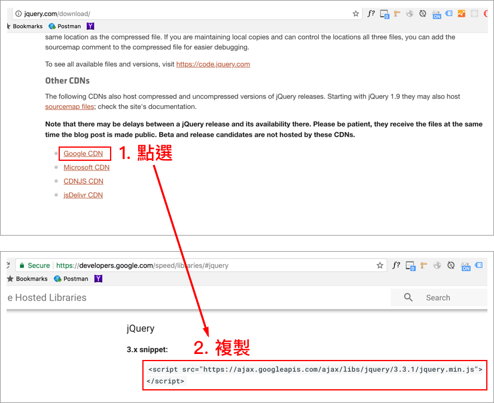

# 4.2.3 jQuery 函式庫

一個 JavaScript 的函式庫，便於操控網頁元素，及提供各種方便的函式，讓開發者不用從頭開始做起。[官方網站](http://jquery.com/)。

## 如何在網頁中載入 jQuery 函式庫

### 方式一\(建議\)：下載 jQuery 函式庫，於網頁中載入

第一步：瀏覽官網網址： [http://jquery.com/download/](http://jquery.com/download/)

第二步：下載，會是一個類似 **jquery-3.5.1.min.js** 的一個 js 檔案：


第三步：於網頁\(**index.html**\)中載入，假設資料夾的結構如下：

* js/jquery-3.5.1.min.js
* index.html

```markup
<!doctype html>
<html>
  <head>
    <meta charset="utf-8">
    <title>這是網頁標題</title>
    <style>
    h1{
      color: red;
    }
    </style>
  </head>
  <body>
    <h1>這是內文標題</h1>

    <!--
      1. 通常建議放在 body 的尾端，讓 html 結構介面先顯示。
      2. 若有用到 jQuery 的相關程式，需撰寫在 jQuery 載入完成之後。
    -->
    <script src="./js/jquery-3.5.1.min.js">
    <!--
      其它 jQuery 相關程式
    -->

  </body>
</html>
```

### 方式二：透過 CDN

第一步：瀏覽官網網址： [http://jquery.com/download/](http://jquery.com/download/)

第二步：



第三步：直接於網頁\(**index.html**\)中載入：

```markup
<!doctype html>
<html>
  <head>
    <meta charset="utf-8">
    <title>這是網頁標題</title>
    <style>
    h1{
      color: red;
    }
    </style>
  </head>
  <body>
    <h1>這是內文標題</h1>

    <!--
      1. 通常建議放在 body 的尾端，讓 html 結構介面先顯示。
      2. 若有用到 jQuery 的相關程式，需撰寫在 jQuery 載入完成之後。
    -->
    <script src="https://ajax.googleapis.com/ajax/libs/jquery/3.3.1/jquery.min.js"></script>
    <!--
      其它 jQuery 相關程式
    -->

  </body>
</html>
```

## 使用範例

JavaScript 版本：

```javascript
var h1 = document.getElementsByTagName("h1")[0];
h1.addEventListener("click", function(){
  alert("open dialog");
});
```

jQuery 版本：

```javascript
var h1 = $("h1")[0];
$(h1).on("click", function(){
  alert("open dialog2");
});
```

