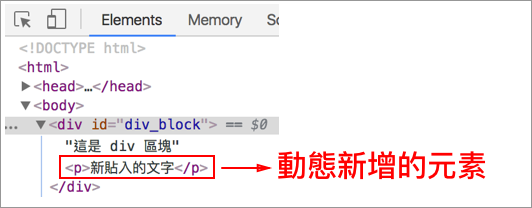

# 4.2.6 JS 與 jQuery 操控網頁元素 - 新增

HTML：

```markup
<div id="div_block">這是 div 區塊</div>
```

JavaScript：

* **document.createElement\(標籤名稱\)**：建立元素的標籤名稱。
* **{element}.appendChild\(元素\)**：替 {element} 的裡面且最後面，加上新的子元素。
* **document.createTextNode\("任何文字"\)**：建立文字節點。

```javascript
// 使用 JS 來建立 <p> 元素，並存於 para 變數之中
var para = document.createElement("p");

// 取得 id 為 div_block 的元素，並存於 div_block 變數之中
var div_block = document.getElementById("div_block");

// 替 div_block 元素，在最尾端新增一個子元素，該元素為 para
div_block.appendChild(para);

// 建立文字節點，文字為「新貼入的文字」，將此節點存於 txt 變數中
var txt = document.createTextNode("新貼入的文字");

// 替 para 元素，加上 txt 節點，即放入文字內容
para.appendChild(txt);
```

結果呈現：



對應的 jQuery 版本：

* **$\("&lt;p&gt;"\)**：動態建立 &lt;p&gt; 元素。
* **{element}.append\(元素\)**：替 {element} 的裡面且最後面，加上新的子元素。
* **{element}.text\("任何文字"\)**：在 {element} 元素，放入欲新增的文字。

```javascript
// 使用 jQuery 來建立 <p> 元素，並存於 para 變數之中
var para = $("<p>");

// 取得 id 為 div_block 的元素，並存於 div_block 變數之中
var div_block = $("#div_block");

// 替 div_block 元素，在最尾端新增一個子元素，該元素為 para
div_block.append(para);

// 替 para 元素，放入文字
para.text("新貼入的文字");
```

## 練習

開啟以下兩個檔案觀察：

檔案所在路徑：`js/4.2.6/index.html`、`js/4.2.6/index_jquery.html`。

