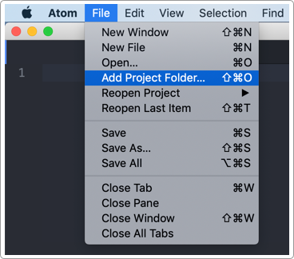

# 課程簡介

## 瀏覽器

課堂上以 Chrome 為主，但網站前端工程師的工作，需要下載各種不同的瀏覽器，以便測試版面、功能狀況。\(請同學至少下載 Chrome 及 Firefox\)：

* [Chrome](https://www.google.com/intl/zh-TW/chrome/)
* [Firefox](https://www.mozilla.org/zh-TW/firefox/new/)
* Safari
* [Edge](https://www.microsoft.com/en-us/edge)
* IE11
* [Opera](https://www.opera.com/zh-tw)

## 編輯器

* [Atom](https://atom.io/)
* [Sublime](https://www.sublimetext.com/)
* [VS Code](https://code.visualstudio.com/)

## 簡介

所有的練習會於課堂上，提供原始碼供學生使用。

網站前端開發，核心技術為 **HTML**、**CSS**、**JavaScript**，從這三個前端技術開始紮根，未來可應用至其他領域\(例：網頁動畫、元件、資料視覺化等\)。故 HTML、CSS、JavaScript 是網站開發中一切的基礎。

這三者分別代表的意義\(以 [carlos-studio.com](https://carlos-studio.com/) 為例\)：

### 

### HTML = HyperText Markup Language

HTML 負責「**結構**」、「**語意**」。

「結構」做的好，對「排版」有幫助。

「語意」做的好，對「SEO」有幫助。

### 

### CSS = Cascading Style Sheets

CSS 負責網頁的「**外觀**」，包含了視覺風格、排版。

### 

### JS = JavaScript

JavaScript 負責「**行為**」，包含了使用者與網頁之間的互動操作。


## 開發工具

### 瀏覽器

課堂上以 Chrome 為主，但網站前端工程師的工作，需要下載各種不同的瀏覽器，以便測試版面、功能狀況。\(請同學至少下載 Chrome 及 Firefox\)：

* [Chrome](https://www.google.com/intl/zh-TW/chrome/)
* [Firefox](https://www.mozilla.org/zh-TW/firefox/new/)
* Safari
* [Edge](https://www.microsoft.com/en-us/edge)
* IE11
* [Opera](https://www.opera.com/zh-tw)

### 

### 編輯器

* [Atom](https://atom.io/)
* [Sublime](https://www.sublimetext.com/)
* [VS Code](https://code.visualstudio.com/)

## 下載練習檔案

[下載連結](http://notes.carlos-studio.com/download/html_css_js.zip)

裡面的所有 html 檔案，點擊兩下，都可於瀏覽器中直接開啟。\(建議使用 Chrome 瀏覽器\)


## 練習：第一個網頁及編輯器

建立一個專案資料夾\(桌面或任何你習慣的位置\)名稱為 **html\_css\_js**，然後使用編輯器開啟這個資料夾，如下圖：



資料夾名稱建議都用英文及底線來取名，該 **html\_css\_js** 資料夾裡面要有以下幾個項目：

* css/
* fonts/
* images/
* js/
* index.html

### 第一步：撰寫 html

寫好後，用瀏覽器開啟看看。

```markup
<!doctype html>
<html>
  <head>
    <meta charset="utf-8">
    <title>這是網頁標題</title>
  </head>
  <body>
    <h1>這是內文標題</h1>
  </body>
</html>
```

### 第二步：撰寫 CSS

以下原始碼放在 `</head>` 結尾標籤之前：

```markup
<style>
  h1{
    color: red;
  }
</style>
```

### 第三步：撰寫 JS

以下原始碼放在 `</body>` 結尾標籤之前：

```markup
<script type="text/javascript">
  var h1 = document.getElementsByTagName("h1")[0];
  h1.addEventListener("click", function(){
    alert("open dialog");
  });
</script>
```

### 組合成一個網頁

```markup
<!doctype html>
<html>
  <head>
    <meta charset="utf-8">
    <title>這是網頁標題</title>
    <style>
    h1{
      color: red;
    }
    </style>
  </head>
  <body>
    <h1>這是內文標題</h1>

    <script type="text/javascript">
      var h1 = document.getElementsByTagName("h1")[0];
      h1.addEventListener("click", function(){
        alert("open dialog");
      });
    </script>

  </body>
</html>
```

即完成了一個可以用瀏覽器開啟的網頁。


